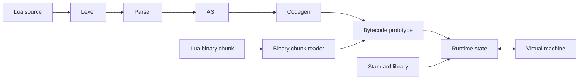

<div align="center">
  

  # LuaInterpreter

  A compact Lua 5.3 interpreter written in Go.

  [](https://github.com/clchen-dev/LuaInterpreter/actions/workflows/ci.yml)
  [](https://go.dev/)
  [](LICENSE.txt)
</div>

LuaInterpreter contains a lexer, parser, bytecode compiler, binary chunk
reader/writer, virtual machine, runtime state, and a small standard-library
subset. It is intended for learning and experimentation rather than as a
drop-in replacement for the official Lua runtime.

## Features

- Lua 5.3-style syntax, expressions, tables, functions, closures, varargs, and loops
- Arithmetic, bitwise, comparison, table, call, and control-flow VM instructions
- Metatables and common metamethods
- `print`, `pairs`, `ipairs`, `next`, `pcall`, `error`, and metatable helpers
- Lua binary chunk serialization and loading
- Embeddable Go API with panic-to-error conversion
- Automated tests, race detection, static analysis, and reproducible CI builds

## Requirements

- Go 1.24 or newer
- GNU Make is optional

The project has no third-party Go dependencies.

## Quick start

Clone and build the command-line interpreter:

```bash
git clone https://github.com/clchen-dev/LuaInterpreter.git
cd LuaInterpreter
go build -trimpath -o bin/luago ./cmd/luago
```

Run one of the included examples:

```bash
./bin/luago examples/test2.lua
```

Or run the published container image:

```bash
docker run --rm ghcr.io/clchen-dev/luago:latest --version
docker run --rm -v "$PWD/examples:/examples:ro" ghcr.io/clchen-dev/luago:latest /examples/test2.lua
```

Expected output:

```text
false	2	0.5	true	-1	-2
```

The CLI accepts one Lua source file:

```text
Usage: luago [flags] <script.lua>
  -version
        print version information
```

## Development

Run the complete local verification suite:

```bash
make ci
```

Or invoke each step directly:

```bash
go fmt ./...
go vet ./...
go test -race -cover ./...
go build -trimpath -o bin/luago ./cmd/luago
```

Integration fixtures live in `interpreter/testdata`. Each `.lua` file has a
matching `.golden` file containing its expected output.

## Project structure

```text
.
├── cmd/luago/              Command-line entry point
├── examples/               Runnable Lua programs
├── interpreter/            Embeddable execution API and integration tests
│   └── testdata/           Lua fixtures and golden output
├── internal/
│   ├── api/                Lua state and VM interfaces
│   ├── binchunk/           Lua 5.3 binary chunk reader and writer
│   ├── compiler/
│   │   ├── ast/            Abstract syntax tree
│   │   ├── codegen/        AST-to-bytecode compiler
│   │   ├── lexer/          Tokenizer
│   │   └── parser/         Recursive-descent parser
│   ├── number/             Lua numeric parsing and operations
│   ├── state/              Stack, values, tables, closures, and runtime API
│   ├── stdlib/             Built-in functions exposed to Lua
│   └── vm/                 Bytecode instructions and opcode definitions
├── .github/workflows/      Continuous integration
├── go.mod
└── Makefile
```

## Architecture



The public `interpreter` package coordinates the pipeline. Compiler, VM, and
runtime implementation details remain under `internal` so they can evolve
without exposing unstable APIs.

## Embedding

Execute Lua from another Go package:

```go
package main

import (
	"os"

	"github.com/clchen-dev/LuaInterpreter/interpreter"
)

func main() {
	vm := interpreter.New(os.Stdout)
	if err := vm.Execute([]byte(`print("hello from Lua")`), "example.lua"); err != nil {
		panic(err)
	}
}
```

## Continuous integration

The GitHub Actions workflow runs on pushes and pull requests. It:

1. verifies formatting with `gofmt`;
2. runs `go vet`;
3. runs tests with the race detector and coverage;
4. builds and smoke-tests the CLI;
5. cross-compiles Linux `amd64` and `arm64` binaries;
6. uploads each compressed binary as a workflow artifact;
7. publishes a multi-architecture Docker image to GitHub Container Registry.

Artifacts are available from the summary page of a completed
[Actions run](https://github.com/clchen-dev/LuaInterpreter/actions/workflows/ci.yml).

Container images are published to:

```text
ghcr.io/clchen-dev/luago
```

Pushes to `main` publish `latest` and commit-SHA tags. Git tags such as
`v0.1.0` publish the same version tag to the image repository.

## Scope and limitations

LuaInterpreter implements a useful Lua 5.3 subset, but compatibility is not
complete. In particular, it does not include the full official Lua standard
library or every language feature. Unsupported behavior should be treated as a
project limitation rather than assumed to match the reference interpreter.

## Contributing

1. Create a focused branch.
2. Add or update tests for behavioral changes.
3. Run `make ci`.
4. Open a pull request describing the change and its compatibility impact.

Bug reports should include a minimal Lua program, expected output, actual
output, Go version, and operating system.

## License

Distributed under the MIT License. See [LICENSE.txt](LICENSE.txt).
